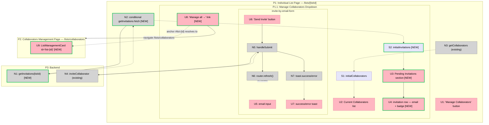

# Invite Collaborators from Individual List View — Breadboard

**Date:** 2026-03-12
**Status:** Ready for spec / slicing

---

## Places

| # | Place | Description |
|---|-------|-------------|
| P1 | Individual List Page | `/lists/[listId]` — server-rendered; `List` component entry point |
| P1.1 | Manage Collaborators Dropdown | Subplace of P1: non-blocking dropdown panel (can click away) |
| P2 | Collaborators Management Page | `/lists/collaborators` — full management page; anchor targets added |
| P3 | Backend | Server actions + database |

---

## UI Affordances

| # | Place | Component | Affordance | Control | Wires Out | Returns To |
|---|-------|-----------|------------|---------|-----------|------------|
| U1 | P1 | list.tsx | "Manage Collaborators" button | click | — (opens dropdown, local state) | — |
| U2 | P1.1 | manage-collaborators | Current Collaborators list | render | — | — |
| U3 | P1.1 | manage-collaborators | **[NEW]** Pending Invitations section | render | — | — |
| U4 | P1.1 | manage-collaborators | **[NEW]** invitation row (email + status badge) | render | — | — |
| U5 | P1.1 | invite-by-email-form | email input | type | — | — |
| U6 | P1.1 | invite-by-email-form | "Send Invite" button | click | → N5 | — |
| U7 | P1.1 | invite-by-email-form | success / error toast | render | — | — |
| U8 | P1.1 | manage-collaborators | **[NEW]** "Manage all →" link | click | → P2 | — |
| U9 | P2 | ListManagementCard | **[NEW]** list card with `id="list-{id}"` | render | — | — |

> U2 and the existing user-search / add / remove affordances inside `manage-collaborators` are unchanged and omitted for clarity.

---

## Code Affordances

| # | Place | Component | Affordance | Control | Wires Out | Returns To |
|---|-------|-----------|------------|---------|-----------|------------|
| N1 | P3 | invitations.ts | **[NEW]** `getInvitations(listId)` | call | → DB (open invitations query) | → N2 |
| N2 | P1 | list.tsx | **[NEW]** conditional invitations fetch (guard: `editableCollaborators`) | call | → N1 | → S2 |
| N3 | P1 | list.tsx | `getCollaborators(listId)` (existing) | call | → DB | → S1 |
| N4 | P3 | invitations.ts | `inviteCollaborator({listId, invitedEmail})` (existing) | call | → DB, email service | → N5 |
| N5 | P1.1 | invite-by-email-form | `handleSubmit(e)` (existing) | call | → N4, → N7, → N6 | — |
| N6 | P1.1 | invite-by-email-form | `router.refresh()` (existing) | call | → P1 (full re-render) | — |
| N7 | P1.1 | invite-by-email-form | `toast.success / toast.error` (existing) | call | — | → U7 |

---

## Data Stores

| # | Place | Store | Description |
|---|-------|-------|-------------|
| S1 | P1.1 | `initialCollaborators` prop (existing) | Accepted collaborators; passed from server render of `list.tsx` to `ManageCollaborators` |
| S2 | P1.1 | **[NEW]** `initialInvitations` prop | Open invitations (`sent` / `pending_approval`) only; passed from server render to `ManageCollaborators` |

S1 → feeds → U2
S2 → feeds → U3, U4

---

## Mermaid Diagram

---

## Workflow Walkthrough

### Workflow 1 — Open dropdown, see state
| Step | Action | Affordances |
|------|--------|-------------|
| 1 | Page renders server-side | N3 → S1; N2 (if `editableCollaborators`) → N1 → S2 |
| 2 | User clicks "Manage Collaborators" | U1 opens dropdown (local state, same Place) |
| 3 | Dropdown renders | S1 → U2 (current collaborators); S2 → U3 → U4 (open invitations); U5/U6 (invite form); U8 (manage link) |

### Workflow 2 — Send email invite
| Step | Action | Affordances |
|------|--------|-------------|
| 1 | User types email | U5 |
| 2 | User clicks "Send Invite" | U6 → N5 |
| 3 | `handleSubmit` calls server action | N5 → N4 |
| 4 | Server action returns result | N4 -.-> N5 |
| 5 | Toast fires | N5 → N7 -.-> U7 |
| 6 | Page re-renders | N5 → N6 → P1 (full re-render; N2/N1 re-run; S2 updated; U3/U4 refresh) |

### Workflow 3 — Navigate to specific list on collaborators page
| Step | Action | Affordances |
|------|--------|-------------|
| 1 | User clicks "Manage all →" | U8 navigates to `/lists/collaborators#list-{listId}` |
| 2 | Browser resolves `#list-{listId}` anchor | U9 — `ListManagementCard` outer div must have `id="list-{listId}"` set; without this the anchor is a no-op and the user lands at the top of the page |

---

## New vs Existing Summary

| Affordance | Status | Change |
|------------|--------|--------|
| N1 `getInvitations(listId)` | **NEW** | New server action — DB query for open invitations only |
| N2 conditional fetch in `list.tsx` | **NEW** | Guarded by `editableCollaborators`; passes result as `initialInvitations` prop |
| S2 `initialInvitations` prop | **NEW** | New prop on `ManageCollaborators` |
| U3 Pending Invitations section | **NEW** | New section in dropdown |
| U4 invitation row (email + badge) | **NEW** | New row component inside U3 |
| U8 "Manage all →" link | **NEW** | New link at bottom of dropdown |
| U9 list card `id` attribute | **NEW** | One attribute added to existing `ListManagementCard` outer div |
| N3, N4, N5, N6, N7, S1, U1, U2, U5, U6, U7 | Existing | Unchanged or composed as-is |
