# Email Invitation System Scenario Story

This document sits next to the implementation plan and explains the feature as a set of user-visible stories.

Primary reference: [2026-03-10-email-invitation-system.md](/Users/emmanuelgenard/Workspace/NextJS-Todo-app/todo-app/thoughts/shared/plans/2026-03-10-email-invitation-system.md)

Audience:
- Engineers implementing the feature
- Reviewers and stakeholders validating the behavior

## Why This Document Exists

The implementation plan is organized by phases, contracts, and test coverage. That is useful for delivery, but it is not the easiest way to understand the feature as an end-to-end user story.

This document tells the story of the feature through scenarios:
- what the user is trying to do
- what the system does
- what state changes
- what the UI should show
- what pseudocode the implementation should roughly follow

## Core Actors

- Owner: user who can invite and manage collaborators for a list
- Recipient: person who receives an invitation email
- Manager: user allowed to manage collaborators for a list
- App UI: dropdown, management page, invite page, sign-in page
- Server Actions: server-authoritative entry points from the UI
- Invitation Service: domain logic for invitations
- Permissions: capability checks for invite/manage operations
- Database:
  - `invitations`: invitation lifecycle and delivery state
  - `list_collaborators`: accepted membership only
- Resend: email provider and webhook source

## Shared Rules Across Every Scenario

- `list_collaborators` contains accepted members only.
- `invitations` contains the invitation lifecycle.
- Invitation secrets are never stored raw; only the hash is persisted.
- A token is usable only while the invitation is still open and not expired.
- Email match accepts immediately.
- Email mismatch becomes `pending_approval`.
- Archive and delete invalidate open invites before success is observable.
- UI actions are never trusted on their own; the server is the source of truth.

## State Model At A Glance

- Open states: `pending`, `sent`
- Review state: `pending_approval`
- Terminal states: `accepted`, `revoked`, `expired`

## Scenario 1: Happy Path From Invite To Accepted Collaborator

### Story

The owner invites someone by email. The email send succeeds. The recipient clicks the link, signs in if needed, the token is valid, the signed-in email matches the invited email, and the recipient becomes a collaborator immediately.

### Expected Outcome

- Invitation row exists with `status = "accepted"`
- `acceptedByUserId` and `resolvedAt` are set
- `list_collaborators` gets a collaborator row
- The recipient can access the list immediately

### Sequence Diagram

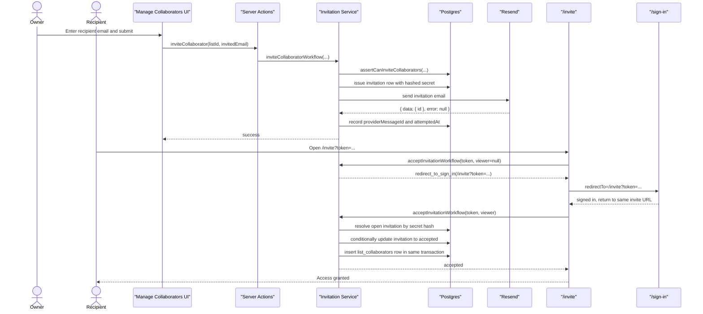

### Pseudocode

```ts
function inviteCollaboratorWorkflow(input) {
  assertCanInviteCollaborators(input.listId, input.inviterId);

  const invitedEmail = normalizeEmail(input.invitedEmail);
  const secret = createInvitationSecret();
  const secretHash = hashInvitationSecret(secret);
  const invitation = issueInvitation({
    listId: input.listId,
    inviterId: input.inviterId,
    invitedEmail,
    secretHash,
    now: input.now,
  });

  const acceptanceUrl = buildInvitationAcceptanceUrl(appBaseUrl, secret);
  const resendResponse = sendInvitationEmail({
    invitationId: invitation.invitationId,
    acceptanceUrl,
  });

  handleInvitationSendResponseWorkflow({
    invitationId: invitation.invitationId,
    resendResponse,
    attemptedAt: now(),
  });

  return { invitationId: invitation.invitationId, acceptanceUrl, resendResponse };
}

function acceptInvitationWorkflow(secret, viewer, now) {
  if (viewer == null) {
    return {
      kind: "redirect_to_sign_in",
      redirectTo: buildInviteContinuationTarget(secret),
    };
  }

  return resolveInviteAcceptance({ invitationSecret: secret, viewer, now });
}

function resolveInviteAcceptance(input) {
  return db.transaction(() => {
    const invitation = findOpenInvitationBySecretHash(input.invitationSecret, input.now);
    if (!invitation) return deriveTerminalOutcome(input.invitationSecret, input.now);

    if (normalizeEmail(input.viewer.email) !== invitation.invitedEmailNormalized) {
      const updated = markPendingApprovalIfStillOpen(invitation.id, input.viewer, input.now);
      if (!updated) return deriveTerminalOutcome(input.invitationSecret, input.now);
      return { kind: "pending_approval", listId: invitation.listId };
    }

    const accepted = markAcceptedIfStillOpen(invitation.id, input.viewer.id, input.now);
    if (!accepted) return deriveTerminalOutcome(input.invitationSecret, input.now);

    insertCollaborator({
      listId: invitation.listId,
      userId: input.viewer.id,
      role: "collaborator",
    });

    return { kind: "accepted", listId: invitation.listId };
  });
}
```

## Scenario 2: Recipient Is Already Signed In With Matching Email

### Story

The recipient clicks the invite link while already signed in with the same email that was invited.

### Expected Outcome

- No sign-in redirect occurs
- Acceptance happens immediately
- Recipient becomes a collaborator

### Sequence Diagram

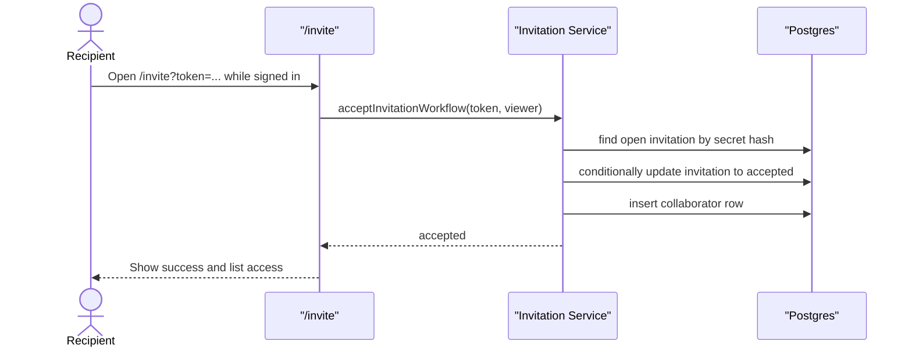

### Pseudocode

```ts
if (viewer != null && emailsMatch(viewer.email, invitation.invitedEmailNormalized)) {
  acceptInvitationAtomically(invitation.id, viewer.id, now);
  return { kind: "accepted", listId: invitation.listId };
}
```

## Scenario 3: Recipient Clicks With Wrong Email And Enters Pending Approval

### Story

The recipient signs in, but the signed-in email does not match the invited email. The system must not silently grant access. Instead, it records who tried to accept and waits for owner approval.

### Expected Outcome

- Invitation moves to `pending_approval`
- `acceptedByUserId` is set
- `acceptedByEmail` is set if the sign-in email differs from the invited email
- No collaborator row is created yet

### Sequence Diagram

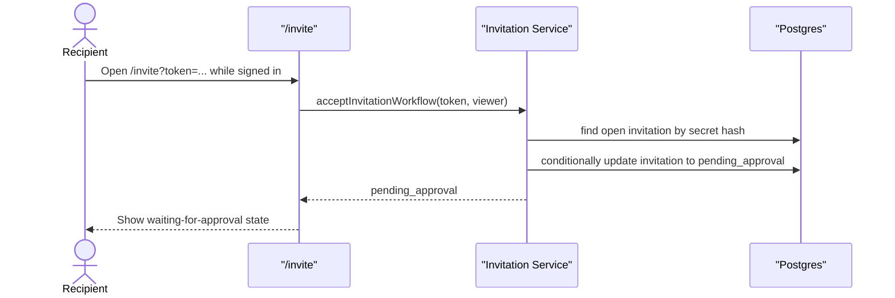

### Pseudocode

```ts
if (!emailsMatch(viewer.email, invitation.invitedEmailNormalized)) {
  const updated = markPendingApprovalIfStillOpen(invitation.id, viewer, now);
  if (!updated) return deriveTerminalOutcome(secret, now);

  return { kind: "pending_approval", listId: invitation.listId };
}
```

## Scenario 4: Manager Approves A Pending Approval Invite

### Story

A manager reviews a `pending_approval` invite, sees which user attempted to join and with which email, and approves the request.

### Expected Outcome

- Invitation moves from `pending_approval` to `accepted`
- `resolvedAt` is set
- `list_collaborators` row is created for `acceptedByUserId`

### Sequence Diagram

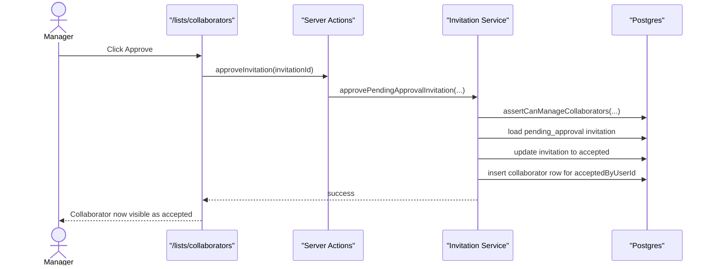

### Pseudocode

```ts
function approvePendingApprovalInvitation(input) {
  assertCanManageCollaborators(input.listId, input.actorId);

  return db.transaction(() => {
    const invitation = getPendingApprovalInvitation(input.invitationId);
    if (!invitation) return terminalManagerOutcome();

    markPendingApprovalAsAccepted(invitation.id, input.now);
    insertCollaborator({
      listId: invitation.listId,
      userId: invitation.acceptedByUserId,
      role: "collaborator",
    });
  });
}
```

## Scenario 5: Manager Rejects A Pending Approval Invite

### Story

The manager decides not to grant access to the user who accepted with a mismatched email.

### Expected Outcome

- Invitation moves to `revoked`
- `resolvedAt` is set
- No collaborator row is created

### Sequence Diagram

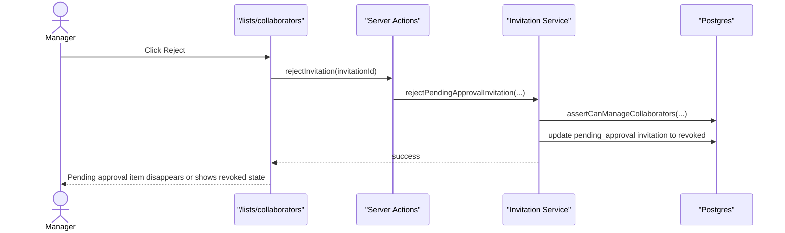

### Pseudocode

```ts
function rejectPendingApprovalInvitation(input) {
  assertCanManageCollaborators(input.listId, input.actorId);
  revokePendingApprovalInvitation(input.invitationId, input.now);
}
```

## Scenario 6: Recipient Clicks An Invalid Token

### Story

The token does not map to any invitation secret hash.

### Expected Outcome

- No database mutation
- Invite page shows `invalid`

### Sequence Diagram

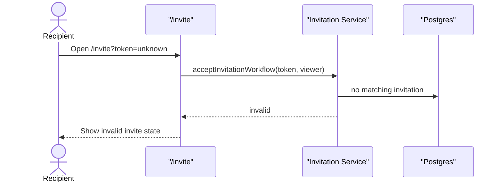

### Pseudocode

```ts
if (!findInvitationBySecretHash(secret)) {
  return { kind: "invalid" };
}
```

## Scenario 7: Recipient Clicks An Expired Token

### Story

The invitation exists, but `expiresAt` has passed.

### Expected Outcome

- Invitation is treated as expired
- Invite page shows `expired`
- No collaborator row is created

### Sequence Diagram


### Pseudocode

```ts
if (invitation.expiresAt <= now) {
  return { kind: "expired" };
}
```

## Scenario 8: Recipient Clicks A Revoked Token

### Story

The invitation was revoked by resend rotation, explicit revoke, archive, delete, or rejection.

### Expected Outcome

- Invite page shows `revoked`
- No collaborator row is created

### Sequence Diagram

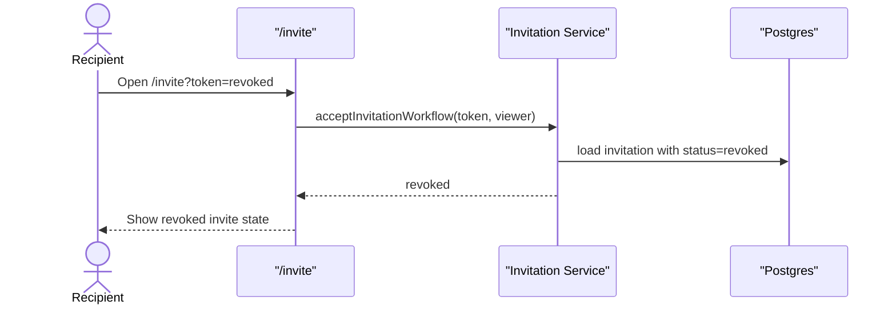

### Pseudocode

```ts
if (invitation.status === "revoked") {
  return { kind: "revoked" };
}
```

## Scenario 9: Recipient Reuses A Consumed Token

### Story

The invitation was already accepted or otherwise resolved, and the user clicks the same link again.

### Expected Outcome

- Invite page shows `already_resolved`
- No second collaborator row is created

### Sequence Diagram

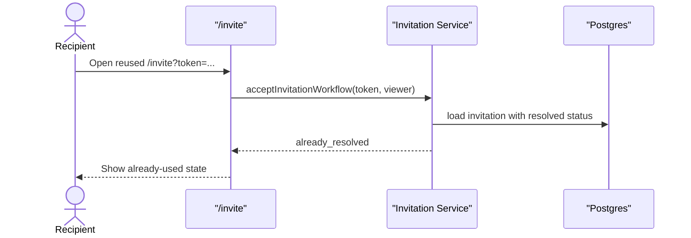

### Pseudocode

```ts
if (invitation.status === "accepted" || invitation.status === "pending_approval") {
  return { kind: "already_resolved" };
}
```

## Scenario 10: Owner Resends An Open Invite

### Story

The owner wants to resend an invitation to the same email. The new email should contain a new authoritative secret, and the previous token must stop working.

### Expected Outcome

- Existing open invite is rotated, not duplicated
- Old token becomes unusable
- New token becomes authoritative

### Sequence Diagram

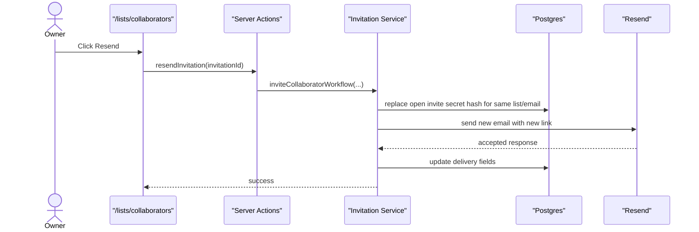

### Pseudocode

```ts
function issueInvitation(input) {
  const existing = findOpenInvitationByListAndEmail(input.listId, input.invitedEmail);
  if (!existing) return insertNewOpenInvitation(input);

  return rotateOpenInvitationSecret(existing.id, input.secretHash, input.now);
}
```

## Scenario 11: Immediate Email Send Failure

### Story

The app successfully issues the invitation row, but Resend rejects the send attempt immediately.

### Expected Outcome

- Invitation row remains in the system
- Delivery fields record the failure
- Manager can later resend

### Sequence Diagram

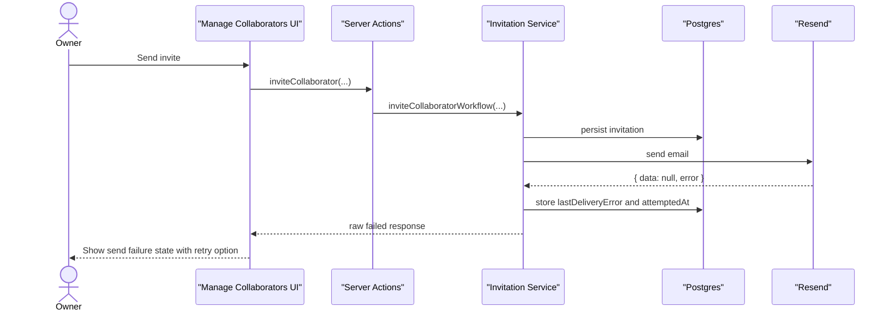

### Pseudocode

```ts
const resendResponse = sendInvitationEmail(...);
const deliveryResult = normalizeResendSendResponse(resendResponse);
recordInvitationSendResult({
  invitationId,
  result: deliveryResult,
  attemptedAt: now,
});
```

## Scenario 12: Resend Webhook Records Delivery Trouble

### Story

Resend later reports `email.failed`, `email.bounced`, `email.delivery_delayed`, or `email.complained`.

### Expected Outcome

- Webhook is signature-verified first
- Matching invitation is updated with latest webhook info
- Invitation membership state is unchanged

### Sequence Diagram

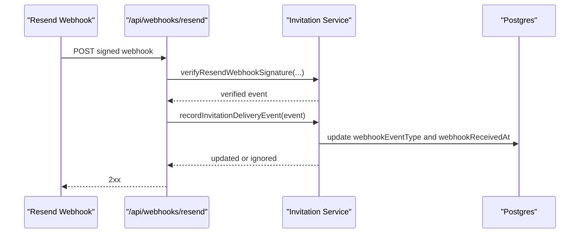

### Pseudocode

```ts
function handleResendWebhookRequest(request) {
  const rawBody = request.text();
  const headers = extractResendWebhookHeaders(request);
  const event = verifyResendWebhookSignature({
    rawBody,
    headers,
    signingSecret: invitationEnv.resendWebhookSecret,
  });

  const persistence = recordInvitationDeliveryEvent({ event });
  return responseForWebhookPersistence(persistence);
}
```

## Scenario 13: Unauthorized User Tries To Invite

### Story

A user who is not allowed to invite collaborators attempts to submit the invite form.

### Expected Outcome

- The attempt is denied
- No invitation row is written
- No email is sent

### Sequence Diagram

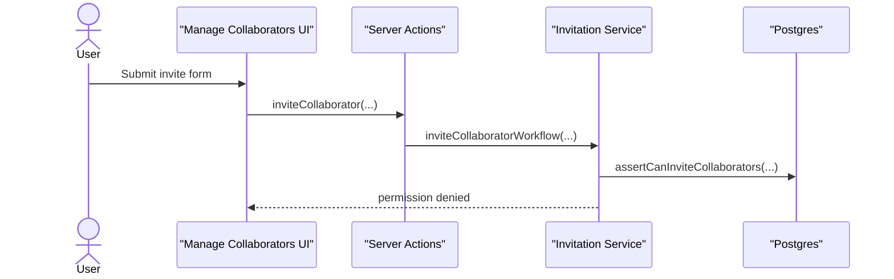

### Pseudocode

```ts
function assertCanInviteCollaborators(input) {
  if (!actorCanInvite(input.actorId, input.listId)) {
    throw new InvitationPermissionDeniedError();
  }
}
```

## Scenario 14: Archive List Invalidates Open Invites

### Story

The owner archives a list that still has open invites.

### Expected Outcome

- Open invites move to a terminal state before archive success is observable
- Accepted collaborators remain collaborators
- Old invite links stop working

### Sequence Diagram

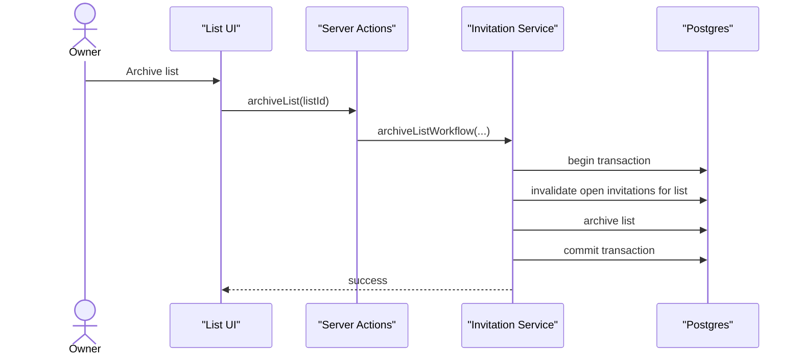

### Pseudocode

```ts
function archiveListWorkflow(input) {
  return db.transaction(() => {
    invalidateOpenInvitesForList({
      listId: input.listId,
      now: now(),
      terminalStatus: "revoked",
    });

    return archiveListRecord(input.listId, input.actorId);
  });
}
```

## Scenario 15: Delete List Invalidates Open Invites Before Removal

### Story

The owner deletes a list that still has open invites. The system must not leave any token valid after deletion succeeds.

### Expected Outcome

- Open invites are invalidated in the same transaction as delete
- No invite token remains usable after delete success

### Sequence Diagram

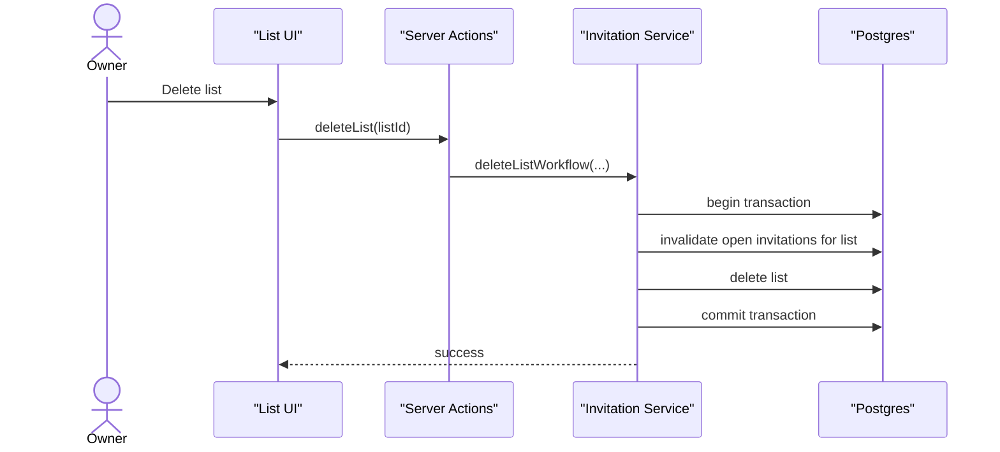

### Pseudocode

```ts
function deleteListWorkflow(input) {
  return db.transaction(() => {
    invalidateOpenInvitesForList({
      listId: input.listId,
      now: now(),
      terminalStatus: "revoked",
    });

    deleteListRecord(input.listId, input.actorId);
  });
}
```

## Scenario 16: Acceptance Loses A Race To Archive Or Delete

### Story

The recipient clicks a valid link at nearly the same time the owner archives or deletes the list. Acceptance must not win based on stale state.

### Expected Outcome

- If invalidation commits first, acceptance returns the correct terminal outcome
- No collaborator row is created

### Sequence Diagram

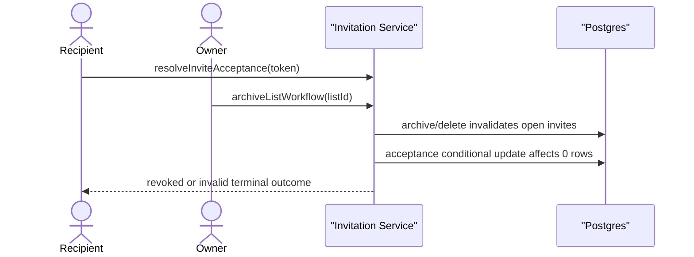

### Pseudocode

```ts
const updated = markAcceptedIfStillOpen(invitation.id, viewer.id, now);

if (!updated) {
  return deriveTerminalOutcome(secret, now);
}
```

## Scenario 17: Manager Loads Collaborator Management View

### Story

A manager opens the dedicated collaborator management page and sees accepted collaborators, open invites, and pending approvals across lists they can manage.

### Expected Outcome

- Unauthorized lists are excluded
- Data comes from accepted collaborators plus invitation summaries
- Available actions depend on state and capability

### Sequence Diagram

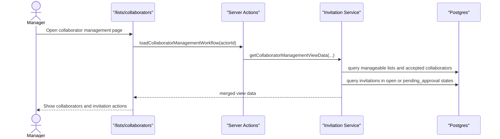

### Pseudocode

```ts
function getCollaboratorManagementViewData(input) {
  const manageableLists = getListsManageableByActor(input.actorId);

  const [acceptedCollaborators, invitations] = Promise.all([
    getAcceptedCollaboratorsForLists(manageableLists.map((list) => list.id)),
    getInvitationSummariesForLists(manageableLists.map((list) => list.id)),
  ]);

  return mergeManagementViewData({
    manageableLists,
    acceptedCollaborators,
    invitations,
  });
}
```

## Scenario 18: Unauthorized User Opens Collaborator Management

### Story

An authenticated user who cannot manage collaborators tries to access the management page or perform management actions.

### Expected Outcome

- The page does not expose unauthorized list data
- Actions are denied server-side

### Sequence Diagram

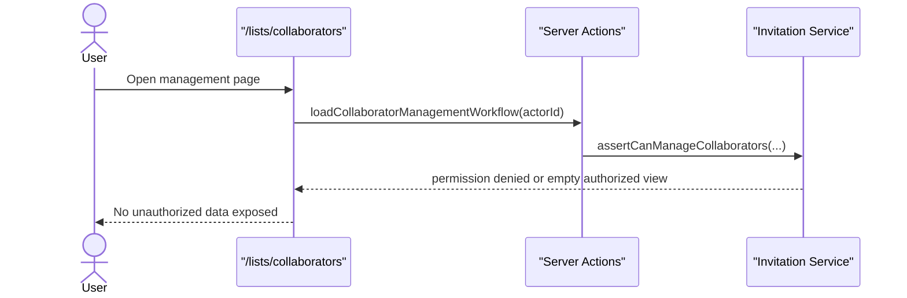

### Pseudocode

```ts
function assertCanManageCollaborators(input) {
  if (!actorCanManageCollaborators(input.actorId, input.listId)) {
    throw new CollaboratorManagementPermissionDeniedError();
  }
}
```

## Core Implementation Skeleton

This is the high-level implementation shape across all scenarios.

```ts
// Invite issuance
inviteCollaboratorWorkflow(input)
  -> assertCanInviteCollaborators(...)
  -> createInvitationSecret()
  -> hashInvitationSecret(...)
  -> issueInvitation(...)
  -> buildInvitationAcceptanceUrl(...)
  -> sendInvitationEmail(...)
  -> handleInvitationSendResponseWorkflow(...)

// Invite acceptance
acceptInvitationWorkflow(input)
  -> if viewer missing: redirect_to_sign_in
  -> resolveInviteAcceptance(...)
     -> find invitation by secret hash
     -> derive invalid/expired/revoked/already_resolved outcomes
     -> if email match: conditionally mark accepted + insert collaborator
     -> else: conditionally mark pending_approval

// Delivery webhooks
handleResendWebhookRequest(request)
  -> read raw body
  -> verifyResendWebhookSignature(...)
  -> recordInvitationDeliveryEvent(...)

// Lifecycle invalidation
archiveListWorkflow(input)
  -> transaction(invalidateOpenInvitesForList + archive list)

deleteListWorkflow(input)
  -> transaction(invalidateOpenInvitesForList + delete list)

// Management
loadCollaboratorManagementWorkflow(input)
  -> assert capability
  -> query accepted collaborators
  -> query invitation summaries
  -> map available actions

approvePendingApprovalInvitation(input)
  -> transaction(mark accepted + insert collaborator)

rejectPendingApprovalInvitation(input)
  -> mark revoked

resendInvitation(input)
  -> rotate open invite secret + send new email

revokeInvitation(input)
  -> mark revoked
```

## Scenario-To-State Summary

| Scenario | Invitation status outcome | Collaborator row |
|---|---|---|
| Happy path acceptance | `accepted` | created |
| Already signed in, matching email | `accepted` | created |
| Mismatched email | `pending_approval` | not created |
| Manager approves mismatch | `accepted` | created |
| Manager rejects mismatch | `revoked` | not created |
| Invalid token | no matching row / `invalid` outcome | not created |
| Expired token | `expired` outcome | not created |
| Revoked token | `revoked` outcome | not created |
| Reused resolved token | `already_resolved` outcome | not created again |
| Resend | still open, secret rotated | unchanged |
| Immediate send failure | still open, delivery error stored | unchanged |
| Delivery webhook trouble | status unchanged, delivery metadata updated | unchanged |
| Archive | open invites terminal | unchanged for accepted members |
| Delete | open invites terminal before delete | unchanged for accepted members before removal |

## What Reviewers Should Look For

- Does every user-visible scenario map cleanly to one invitation state transition?
- Is every access grant mediated by a server-side capability check?
- Is any path accidentally writing to `list_collaborators` before acceptance or approval?
- Can any old token remain usable after resend, revoke, archive, or delete?
- Does every terminal outcome produce an explicit user-facing state?
- Are delivery failures visible without being confused with membership state?

